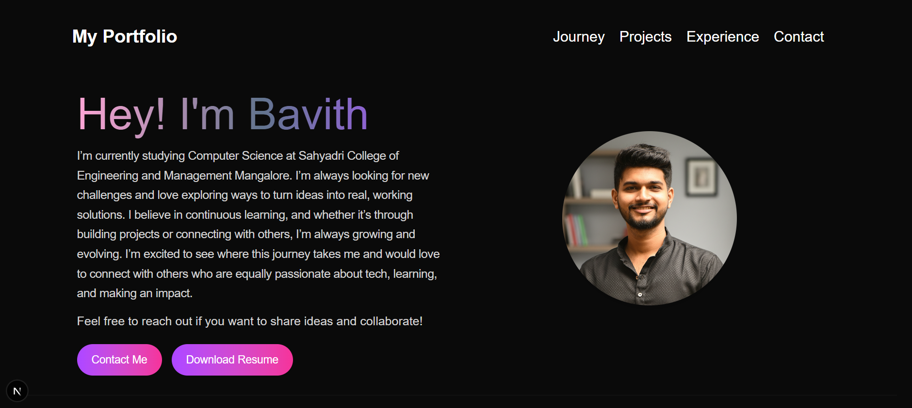
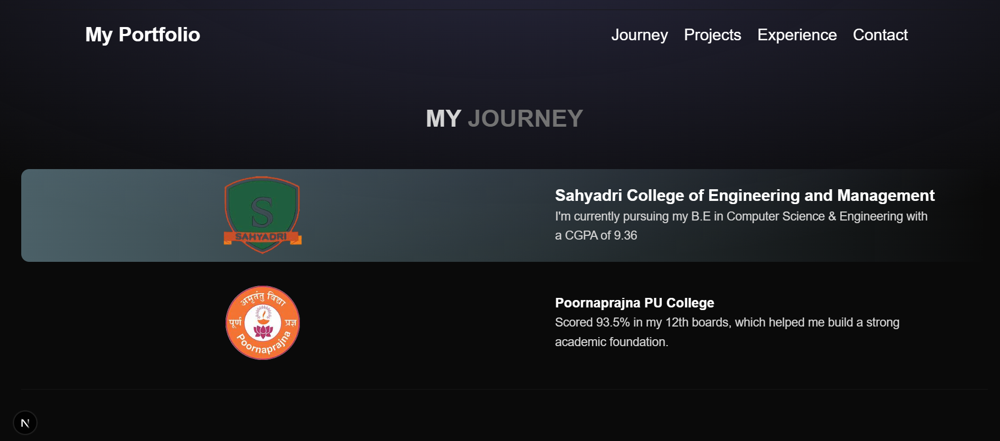
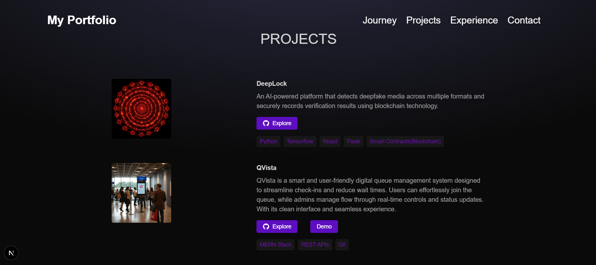
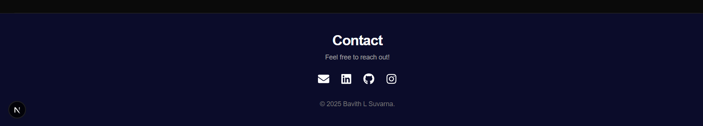

# Portfolio – Bavith L Suvarna

A modern, animated personal portfolio website built using **Next.js** and **Tailwind CSS**.  
This portfolio showcases my **journey, projects, tech arsenal, achievements and contact links**, with smooth animations and a clean dark gradient UI.

---

## Features

- Modern responsive UI (desktop + mobile navbar)
- Animated sections using Framer Motion
- Projects section with GitHub + optional live demo links
- Achievements section with image grid
- Resume download link
- Smooth scroll to sections
- Fully responsive design

---

## Screenshots

### Hero Section

### Journey

### Projects

### Experience

### Contact

---

## 🛠 Tech Stack

- **Framework:** Next.js
- **Styling:** Tailwind CSS
- **Animations:** Framer Motion
- **Icons:** Lucide React + React Icons
- **Version Control:** Git & GitHub

---

## Live link

https://portfolio-using-next-js-sand.vercel.app
